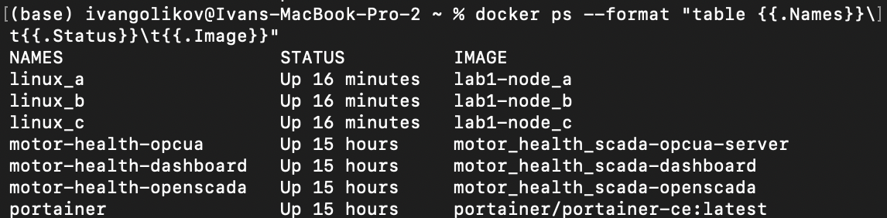
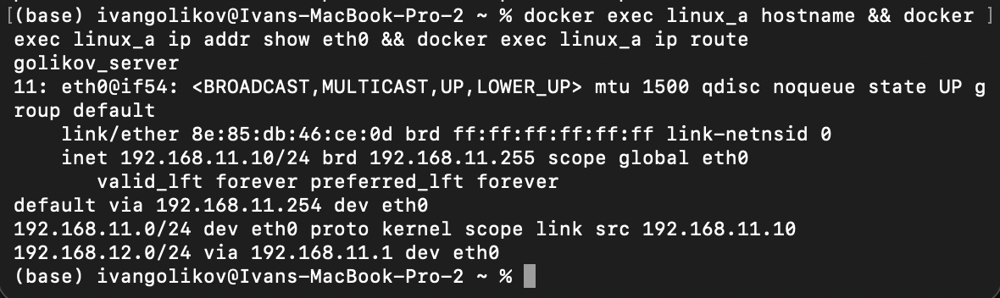
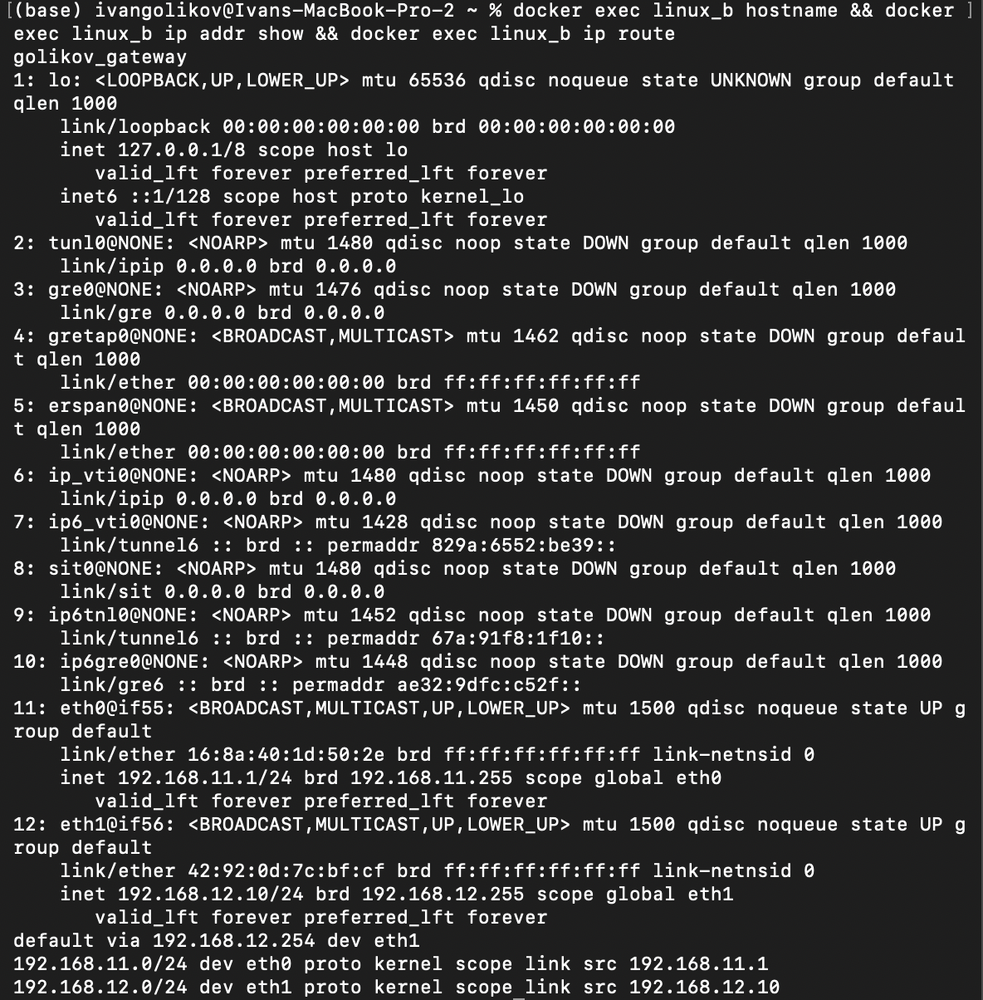
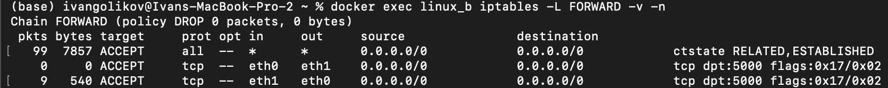
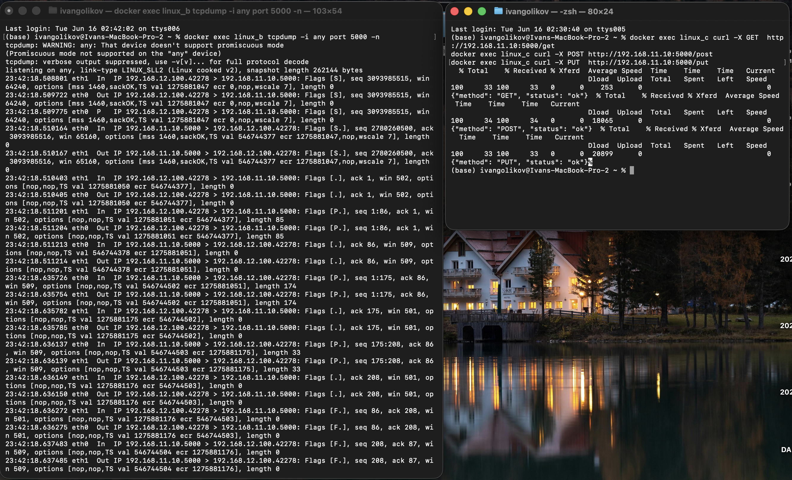
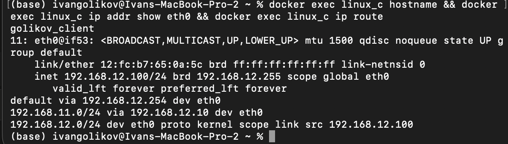
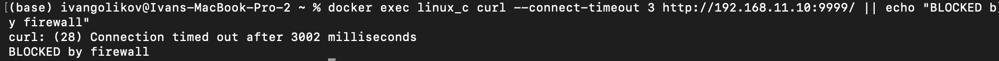
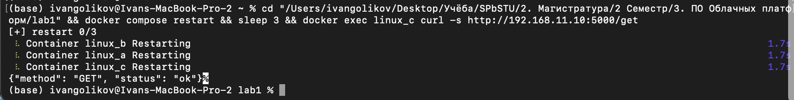

# Лабораторная работа 1 - Администрирование Linux

## Введение

Задача: развернуть 3 виртуальные Linux-машины с настроенной сетевой топологией, где машина B (шлюз) маршрутизирует HTTP-трафик между машиной A (сервер) и машиной C (клиент).

Среда выполнения: Docker Desktop. Подход аналогичен Play with Docker, но без таймаута сессии.

---

## Топология сети

```
Linux A (golikov_server)             Linux B (golikov_gateway)             Linux C (golikov_client)
192.168.11.10/24 ---- [servernet] ---- 192.168.11.1/24
                                        192.168.12.10/24 ---- [clientnet] ---- 192.168.12.100/24
```

День и месяц рождения совпадают (11.11), поэтому для второй подсети используется 192.168.12.0/24, чтобы избежать IP-конфликта.

| Машина | Hostname | IP-адрес(а) | Роль |
|--------|----------|-------------|------|
| Linux A | golikov_server | 192.168.11.10/24 | HTTP-сервер |
| Linux B | golikov_gateway | 192.168.11.1/24, 192.168.12.10/24 | Шлюз + файрвол |
| Linux C | golikov_client | 192.168.12.100/24 | HTTP-клиент |



---

## Linux A - HTTP-сервер

### Конфигурация сети

Интерфейс eth0 с адресом 192.168.11.10/24. Маршрут к подсети C через шлюз B:

```
ip route add 192.168.12.0/24 via 192.168.11.1
```

Результат `ip addr` и `ip route`:

```
11: eth0@if54: <BROADCAST,MULTICAST,UP,LOWER_UP> mtu 1500 qdisc noqueue state UP group default
    inet 192.168.11.10/24 brd 192.168.11.255 scope global eth0

default via 192.168.11.254 dev eth0
192.168.11.0/24 dev eth0 proto kernel scope link src 192.168.11.10
192.168.12.0/24 via 192.168.11.1 dev eth0
```



### Flask HTTP-сервер (порт 5000)

Файл `application/app.py`:

```python
from flask import Flask
import json

app = Flask(__name__)

@app.route('/get', methods=['GET'])
def get_handler():
    return json.dumps({"method": "GET", "status": "ok"})

@app.route('/post', methods=['POST'])
def post_handler():
    return json.dumps({"method": "POST", "status": "ok"})

@app.route('/put', methods=['PUT'])
def put_handler():
    return json.dumps({"method": "PUT", "status": "ok"})

if __name__ == '__main__':
    app.run(host='0.0.0.0', port=5000)
```

Сервис запускается автоматически через entrypoint (`configs/nodeA/entrypoint.sh`) и поднимается при каждом старте контейнера (`restart: always`).

---

## Linux B - Шлюз

### Конфигурация сети

Два интерфейса: eth0 (servernet) и eth1 (clientnet):

```
11: eth0@if55: <BROADCAST,MULTICAST,UP,LOWER_UP> mtu 1500 qdisc noqueue state UP group default
    inet 192.168.11.1/24 brd 192.168.11.255 scope global eth0
12: eth1@if56: <BROADCAST,MULTICAST,UP,LOWER_UP> mtu 1500 qdisc noqueue state UP group default
    inet 192.168.12.10/24 brd 192.168.12.255 scope global eth1

default via 192.168.12.254 dev eth1
192.168.11.0/24 dev eth0 proto kernel scope link src 192.168.11.1
192.168.12.0/24 dev eth1 proto kernel scope link src 192.168.12.10
```



### IP Forwarding

```bash
echo 1 > /proc/sys/net/ipv4/ip_forward
```

### Маршрутизация через iptables

Разрешены только соединения по порту 5000, всё остальное блокируется:

```bash
iptables -A FORWARD -m conntrack --ctstate ESTABLISHED,RELATED -j ACCEPT
iptables -A FORWARD -i eth0 -o eth1 -p tcp --dport 5000 --syn -j ACCEPT
iptables -A FORWARD -i eth1 -o eth0 -p tcp --dport 5000 --syn -j ACCEPT
iptables -P FORWARD DROP
```

Результат `iptables -L FORWARD -v -n`:

```
Chain FORWARD (policy DROP 0 packets, 0 bytes)
pkts  bytes  target  prot opt  in    out   source     destination
  99   7857  ACCEPT  all  --   *     *     0.0.0.0/0  0.0.0.0/0   ctstate RELATED,ESTABLISHED
   0      0  ACCEPT  tcp  --   eth0  eth1  0.0.0.0/0  0.0.0.0/0   tcp dpt:5000 flags:0x17/0x02
   9    540  ACCEPT  tcp  --   eth1  eth0  0.0.0.0/0  0.0.0.0/0   tcp dpt:5000 flags:0x17/0x02
```



### tcpdump

Запуск с фильтрацией по порту 5000:

```bash
tcpdump -i any port 5000 -n
```

Пример вывода при передаче запросов от C к A:

```
23:21:25 eth0  In  IP 192.168.12.100.42580 > 192.168.11.10.5000: Flags [S]
23:21:25 eth1  Out IP 192.168.12.100.42580 > 192.168.11.10.5000: Flags [S]
23:21:25 eth1  In  IP 192.168.11.10.5000 > 192.168.12.100.42580: Flags [S.]
23:21:25 eth0  Out IP 192.168.11.10.5000 > 192.168.12.100.42580: Flags [S.]
```

Видно форвардинг пакетов: eth0 (In от C) -> eth1 (Out к A) и обратно.



---

## Linux C - Клиент

### Конфигурация сети

Интерфейс eth0 с адресом 192.168.12.100/24. Маршрут к подсети A через шлюз B:

```
ip route add 192.168.11.0/24 via 192.168.12.10
```

Результат:

```
11: eth0@if53: <BROADCAST,MULTICAST,UP,LOWER_UP> mtu 1500 qdisc noqueue state UP group default
    inet 192.168.12.100/24 brd 192.168.12.255 scope global eth0

default via 192.168.12.254 dev eth0
192.168.11.0/24 via 192.168.12.10 dev eth0
192.168.12.0/24 dev eth0 proto kernel scope link src 192.168.12.100
```



### Запросы к HTTP-серверу

```bash
curl -X GET  http://192.168.11.10:5000/get
# {"method": "GET", "status": "ok"}

curl -X POST http://192.168.11.10:5000/post
# {"method": "POST", "status": "ok"}

curl -X PUT  http://192.168.11.10:5000/put
# {"method": "PUT", "status": "ok"}
```

### Проверка блокировки файрволом

Попытка подключиться на порт 9999 (не 5000):

```bash
curl --connect-timeout 3 http://192.168.11.10:9999/
# curl: (28) Connection timed out after 3006 milliseconds
```

Пакет был отброшен iptables на шлюзе B (политика FORWARD DROP).



---

## Автозапуск при перезагрузке

Все три контейнера настроены с `restart: always` в docker-compose.yml. После `docker compose restart` все сервисы и маршруты восстанавливаются автоматически через entrypoint-скрипты.

Проверка:

```bash
docker compose restart
# Container linux_a Started
# Container linux_b Started
# Container linux_c Started

docker exec linux_c curl -s http://192.168.11.10:5000/get
# {"method": "GET", "status": "ok"}
```



---

## Структура репозитория

```
lab1/
  application/
    app.py              - Flask HTTP-сервер с эндпоинтами /get, /post, /put
    Dockerfile          - образ на python:3.11-alpine с iproute2, iptables, tcpdump, curl
    requirements.txt    - flask==3.0.0
  configs/
    nodeA/
      entrypoint.sh     - маршрут + запуск Flask
    nodeB/
      entrypoint.sh     - ip_forward + iptables + tcpdump + sleep
    nodeC/
      entrypoint.sh     - маршрут + sleep
  docker-compose.yml    - описание трёх сервисов и двух сетей
  report.md             - данный отчёт
```
